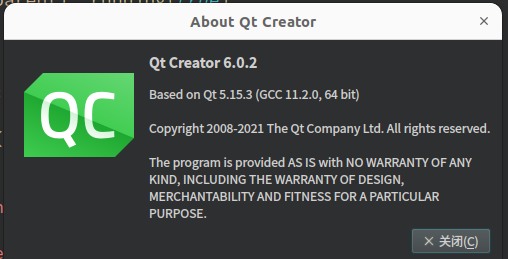
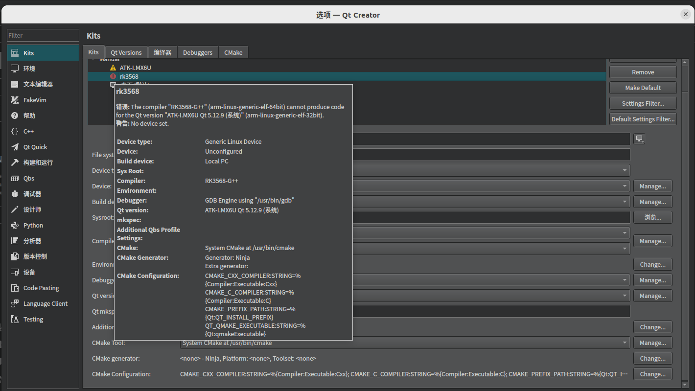
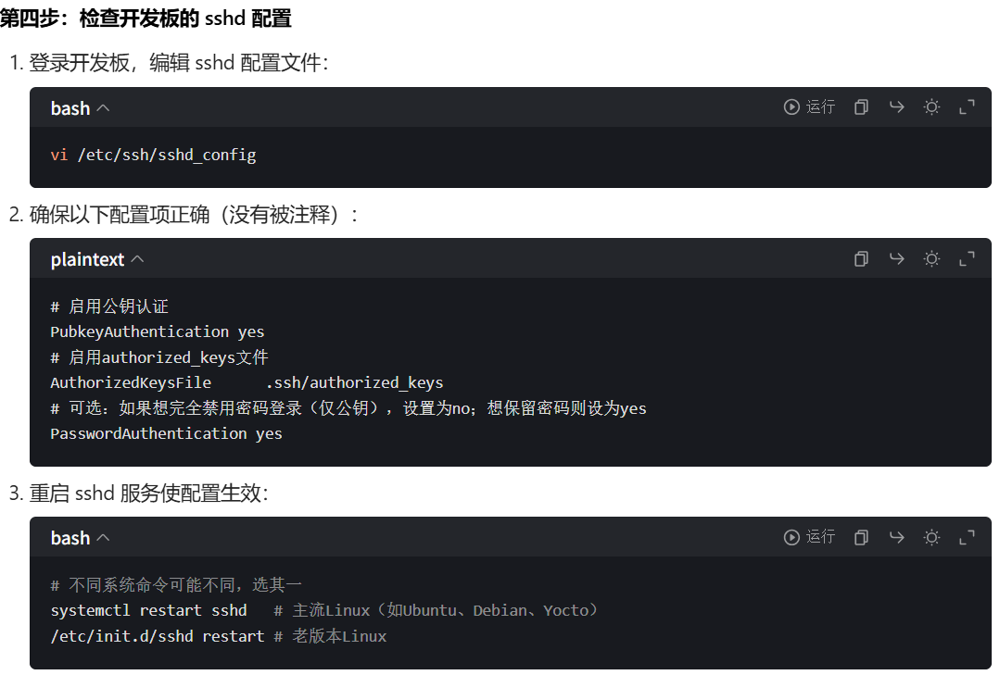
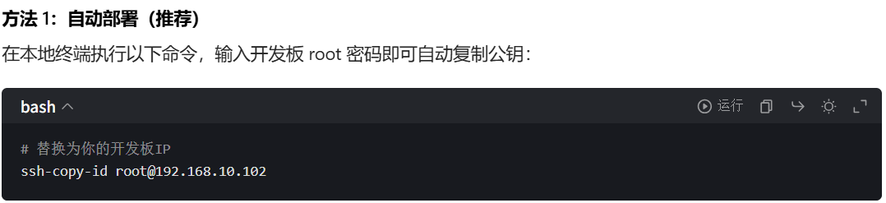

# QT前端代码

qt版本信息，不同版本需要考虑兼容性的问题，可以在网上搜索教程

代码就如文件夹内所示，将文件导入到ubuntu虚拟机后在qt里面打开.pro文件即可，只要是设计了5个页面

1. 温度控制：使用ds18b20获取环境温度，在页面上设计加热和制冷的分页图标，温度控制可以使用上下拖动模式，也可以点击温度手动设置。
2. ai对话：微信聊天形式的页面显示。
3. 环境状态获取：显示当前位置的温湿度、pm2.5浓度等，同时可以获取近两小时的下雨状况。
4. 紫外线杀菌和空气净化：同样使用分页图标，点击时间可以手动设置时间，时间结束后自动停止。
5. wifi连接：扫描周围wifi，然后可以手动输入密码进行连接，如果不连接wifi的话ai对话和环境状态无法获取。

不想继续进行文件修改的读者可以在开发板上配置好qt5环境后直接执行`bingxiang_demo_output`文件夹内的[bingxiang_demo](./bingxiang_demo_output/bingxiang_demo)即可。

作者知道使用像rk3568这种高速开发板进行前后端代码设计，不将开发板的原理图和pcb板文件给出，单移植代码复刻起来难度比较高(可能作者比较菜，但前几天看高速板设计真是看着头大，所以放弃了学习高速板的想法)，所以这里给出作者写qt代码时遇到的问题，希望对各位有帮助。

1.搭建qt交叉编译环境问题

在说问题之前先给不知道的读者科普一下，qt交叉编译环境的搭建需要gcc/g++、qmake、qtcreator这三样东西，qtcreator就是下载的软件，qmake和gcc/g++需要自己手动下载(因为ubuntu或者windows上下载的qt自带gcc/g++和qmake都是服务x86架构的，而开发板一般是arm架构)，根据自己的开发板，一般厂商都会给出qmake和gcc/g++的文件，直接配置即可。

我遇到的问题主要是32位arm的qmake不能兼容64位arm的qmake，这个问题看起来很蠢，但是由于作者之前学习过i.mx6ull开发板的配置，那个时候下载过一次qmake，但是是32位的，想偷个懒就没按3568厂商给的教程重新下载，直到作者发现原来将鼠标移动到报错位置可以查看报错信息...

2.qt部署远程连接设备问题

主要是不知道ssh连接相关的内容，导致使用default模式每次都要手动输入密码，比较麻烦，后面查了一下公私钥的定义，使用Specific_key模式就解决了。

配置好后在qt里面创建密钥，然后将密钥部署到开发板

上面都是询问豆包得到的解决方法，不得不说现在ai还是很强大的。