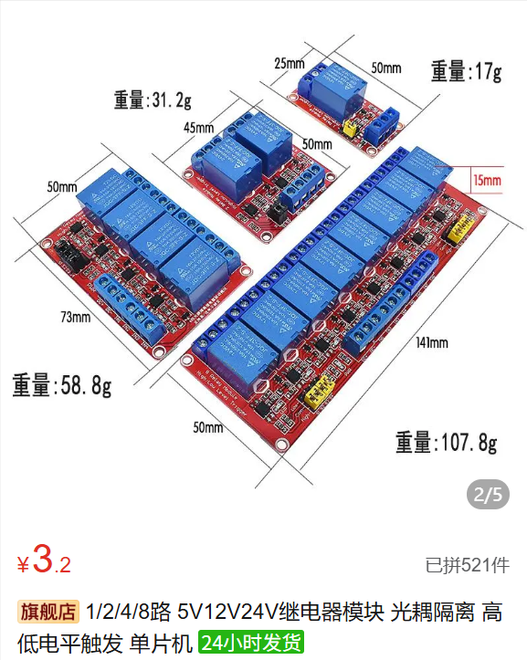
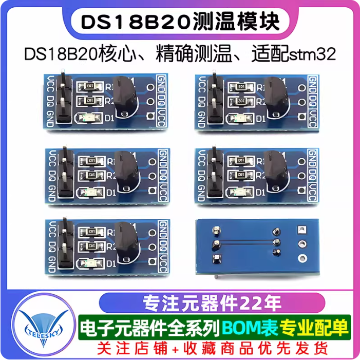

# 嘉立创PCB文件

这里的pcb主要是两个扩展板，使用的开发板不一样的话pcb文件没有参考价值，不建议下载，这里给出思路。

1.因为做的是一个民用产品，所以首先得需要220v的电压输入转为直流输出，在淘宝上买一个220v转12v的变压器(转多少v直流自己决定)，转12v是因为提前买了12v的加热片和制冷片。

2.因为需要使用开发板上的gpio控制外部器件的通断，rk3568 gpio最高输出3.3v，所以需要一个能够3.3v控制12v电压通断的元件，作者选用的是3.3v电平触发的继电器(需要考虑到12v那边的最大电流，大功率制冷片需要的电流很大)，理论上来说也可以三极管或者mos管，但三极管需要拉高基极电压，mos管需要拉高栅极电压，我在设计时考虑的是都得拉高到12v左右才能控制通断，但gpio只能输出3.3v电压，我也想过手动拉高，但可能会导致电流倒流？现在想想好像可以拉低发射极或者漏极电压？各位如果会使用的话可以尝试使用这种能通过大电流的相关器件，好处是可以使用pwm波来动态控制制冷片和加热片的电流，坏处呢，好像基本没有坏处。

3.冰箱内部的温度获取使用ds18b20，驱动代码和设备树配置在`4.Driver Code`文件夹中，这种单总线协议用软件模拟的时序，所以移植起来还是比较简单，驱动代码不用改，设备树的配置根据自己使用的芯片和引脚进行配置。

4.不想写了，先写到这